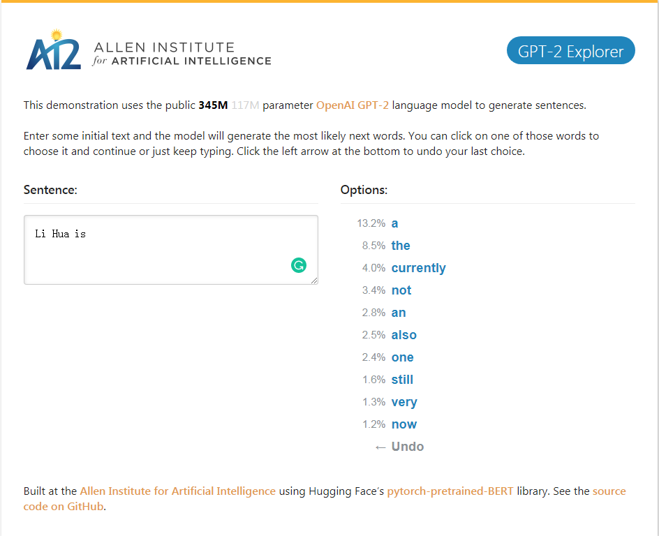
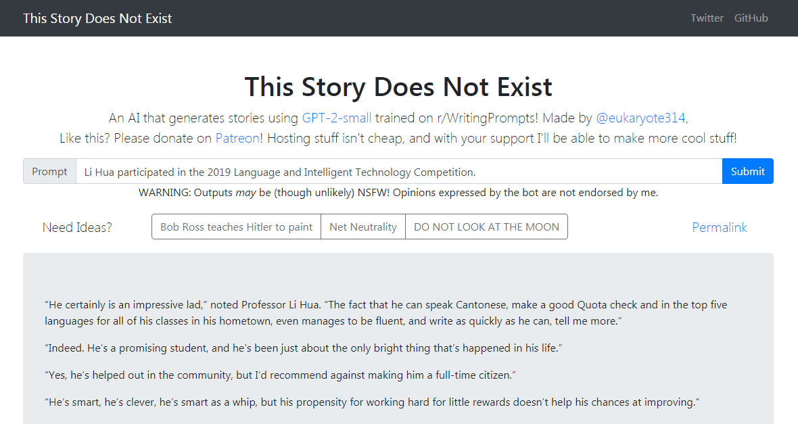
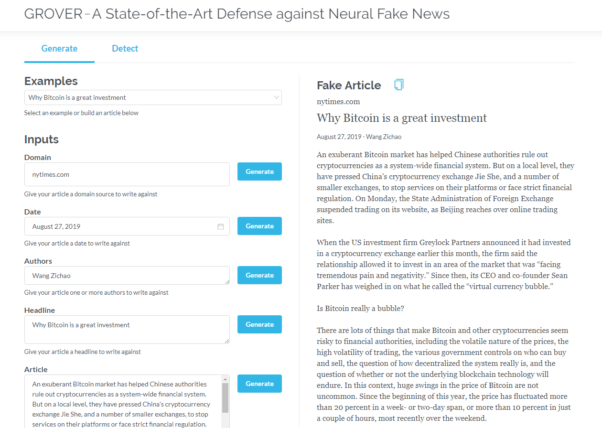
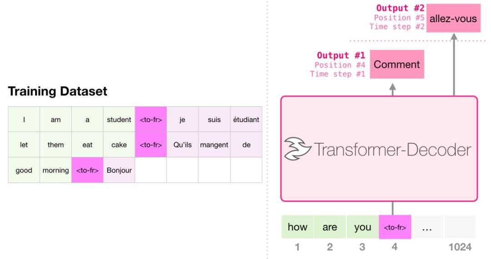
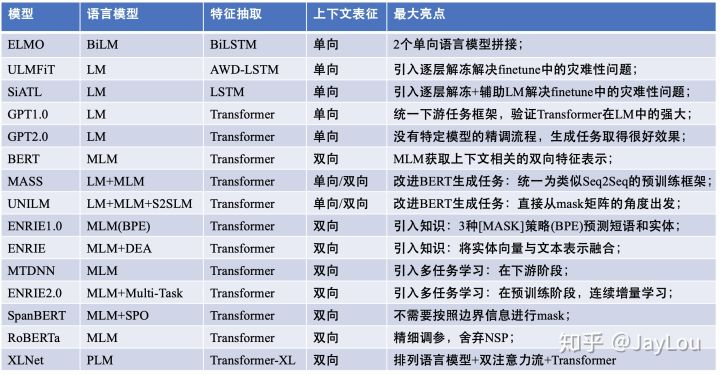

# Text generation task and language model GPT2
The first part of this resource pool summarizes the resources used to solve text generation tasks using the language model GPT2, including papers, code, demo demos, and hands-on tutorials. The second part shows the application of GPT2 in the text generation tasks of machine translation, automatic summary generation, migration learning and music generation. Finally, the 15 major language models based on Transformer between 2018 and 2019 are compared.

本资源汇第一部分汇总了使用语言模型GPT2来解决文本生成任务的资源，包括论文、代码、展示demo和动手教程。第二部展示了GPT2在机器翻译、自动摘要生成、迁移学习和音乐生成这些文本生成任务上的应用。最后对比了2018-2019年间重要的基于Transformer的15个语言模型

## GPT-2
GPT-2 is a large transformer-based language model released by OpenAI in February 2019. It contains 1.5 billion parameters and is trained on a 8 million web dataset. According to reports, the model is a direct extension of the GPT model, training on more than 10 times the amount of data, the parameter amount is also 10 times more. In terms of performance, the model is capable of producing coherent text paragraphs and achieves SOTA performance on many language modeling benchmarks. Moreover, the model can perform preliminary reading comprehension, machine translation, question and answer and automatic summarization without task-specific training.

GPT-2是OpenAI于2019年2月发布的基于 transformer 的大型语言模型，包含 15 亿参数、在一个 800 万网页数据集上训练而成。据介绍，该模型是对 GPT 模型的直接扩展，在超出 10 倍的数据量上进行训练，参数量也多出了 10 倍。在性能方面，该模型能够生产连贯的文本段落，在许多语言建模基准上取得了 SOTA 表现。而且该模型在没有任务特定训练的情况下，能够做到初步的阅读理解、机器翻译、问答和自动摘要。

+ 主页 OpenAI Homepage : [Better Language Models and Their Implications](https://openai.com/blog/better-language-models/)
+ 代码 Code : [gpt-2](https://github.com/openai/gpt-2)
+ 论文 OpenAI 2019 Paper : [Language Models are Unsupervised Multitask Learners](https://d4mucfpksywv.cloudfront.net/better-language-models/language_models_are_unsupervised_multitask_learners.pdf)

### GPT-2 Demo
GPT-2_Explorer Demo It can give the next ten words of the possibility ranking and their corresponding probabilities according to the currently input text. You can select one of the words, then see the list of the next possible word, and so on, and finally complete one. Article.

GPT-2_Explorer Demo 它可以根据当前输入的文本给出可能性排名前十的下一个单词及其对应概率，你可以选择其中一个单词，然后看到下一个可能单词的列表，如此往复，最终完成一篇文章。

[点击体验 Click to GPT-2 Explorer Demo](https://gpt2.apps.allenai.org/?text=Joel%20is)

### GPT-2 elevant articles
+ [效果惊人的GPT 2.0模型：它告诉了我们什么 张俊林](https://zhuanlan.zhihu.com/p/56865533)
+ [完全图解GPT-2：看完这篇就够了（一）](http://www.sohu.com/a/336262203_129720) [完全图解GPT-2：看完这篇就够了（二）](https://www.jiqizhixin.com/articles/2019-08-26-12)
+ [The Illustrated GPT-2 (Visualizing Transformer Language Models)](https://jalammar.github.io/illustrated-gpt2/)

### hands-on GPT-2
+ [GPT-2 试用总结及感想](https://zhuanlan.zhihu.com/p/56869079)

---

## GPT-2-simple
GPT-2-simple Python package to easily retrain OpenAI's GPT-2 text-generating model on new texts.

GPT-2-simple Python包可以轻松地在新文本上重新训练OpenAI的GPT-2文本生成模型。

+ 代码 Code : [gpt-2-simple](https://github.com/minimaxir/gpt-2-simple)

### GPT-2-simple Demo
GPT-2-simple Demo Writes a follow-up story based on the current input text.
GPT-2-simple Demo 根据当前输入文本编写后续的故事。

[点击体验 Click to gpt-2-simple Demo](https://www.thisstorydoesnotexist.com/)

---

## grover: OpenGPT-2
Grover is a model for Neural Fake News -- both generation and detection.
Grover是神经虚假新闻的模型 - 生成和检测。

+ 项目主页 Project Home : [Grover: A State-of-the-Art Defense against Neural Fake News](https://rowanzellers.com/grover/)
+ 代码 Code : [grover](https://github.com/rowanz/grover)
+ 论文 2019 Paper : [Defending Against Neural Fake News](https://arxiv.org/abs/1905.12616)

### grover demo
Generate articles based on information such as title, author, and more. Grover can also detect if text is generated by the machine.

根据标题、作者等信息生成文章。grover 还可以检测文本是否由机器生成。

[点击体验 Click to GROVER](https://grover.allenai.org)

### grover elevant articles
+ [OpenGPT-2: We Replicated GPT-2 Because You Can Too](https://medium.com/@vanya_cohen/opengpt-2-we-replicated-gpt-2-because-you-can-too-45e34e6d36dc)
+ [Counteracting neural disinformation with Grover](https://medium.com/ai2-blog/counteracting-neural-disinformation-with-grover-6cf6690d463b)
+ [15亿参数的GPT-2被两个CS硕士复制出来了，没有语言建模经验，花了5万美元](https://www.jiqizhixin.com/articles/2019-08-24)

---

## 语言建模之外 Beyond Language Modeling

[Click to read the English version](https://jalammar.github.io/illustrated-gpt2/)

只包含解码器的 transformer （比如GPT2）不断地表现出在语言建模之外的应用前景。在许多应用程序中，这类模型已经取得了成功：机器翻译、自动摘要生成、迁移学习和音乐生成。让我们一起来回顾一下其中的一些应用。

### 机器翻译
进行翻译时，模型不需要编码器。同样的任务可以通过一个只有解码器的 transformer 来解决：

### 自动摘要生成
这是第一个训练只包含解码器的 transformer 的任务。也就是说，该模型被训练来阅读维基百科的文章（没有目录前的开头部分），然后生成摘要。文章实际的开头部分被用作训练数据集的标签：

论文使用维基百科的文章对模型进行了训练，训练好的模型能够生成文章的摘要：

### 迁移学习
在论文 [Sample Efficient Text Summarization Using a Single Pre-Trained Transformer](https://arxiv.org/abs/1905.08836)中，首先使用只包含解码器的 transformer 在语言建模任务中进行预训练，然后通过调优来完成摘要生成任务。结果表明，在数据有限的情况下，该方案比预训练好的编码器-解码器 transformer 得到了更好的效果。
GPT2 的论文也展示了对语言建模模型进行预训练后取得的摘要生成效果。

### 音乐生成
音乐 [transformer](https://magenta.tensorflow.org/music-transformer) 采用了只包含解码器的 transformer 来生成具有丰富节奏和动感的音乐。和语言建模相似，「音乐建模」就是让模型以一种无监督的方式学习音乐，然后让它输出样本（我们此前称之为「随机工作」）。

---

## 了解更多基于 Transformer 的模型
GPT2只是基于 Transformer 的模型的沧海一粟，2018-2019年的15个重要的基于Transformer 的模型的对比可以参见 [后BERT时代：15个预训练模型对比分析与关键点探索](https://zhuanlan.zhihu.com/p/76912493)

